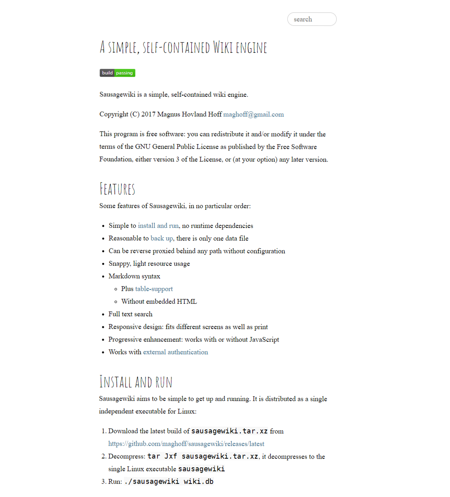

Sausagewiki is a simple, self-contained wiki engine.

Copyright (C) 2017 Magnus Hovland Hoff <maghoff@gmail.com>

This program is free software: you can redistribute it and/or modify it under
the terms of the GNU General Public License as published by the Free Software
Foundation, either version 3 of the License, or (at your option) any later
version.

Preview
======

Features
========
Some features of Sausagewiki, in no particular order:

 * Simple to [install and run](#install-and-run), no runtime dependencies
 * Reasonable to [back up](https://github.com/maghoff/sausagewiki/wiki/Backup),
   there is only one data file
 * Can be reverse proxied behind any path without configuration
 * Snappy, light resource usage
 * Markdown syntax
    * Plus [table-support](https://help.github.com/articles/organizing-information-with-tables/)
    * Without embedded HTML
 * Full text search
 * Responsive design: fits different screens as well as print
 * Progressive enhancement: works with or without JavaScript
 * Works with [external authentication](https://github.com/maghoff/sausagewiki/wiki/Enabling-authentication)

Install and run
===============
Sausagewiki aims to be simple to get up and running. It is distributed as a
single independent executable for Linux:

 1. Download the latest build of `sausagewiki.tar.xz` from <https://github.com/maghoff/sausagewiki/releases/latest>
 2. Decompress: `tar Jxf sausagewiki.tar.xz`, it decompresses to the single
    Linux executable `sausagewiki`
 3. Run: `./sausagewiki wiki.db`

For a more permanent installation, you could [install Sausagewiki as a systemd
service](https://github.com/maghoff/sausagewiki/wiki/System-wide-installation-with-systemd).

Alternative installation methods include the following:

**Build from source** with `cargo build --release`, producing the binary as
`target/release/sausagewiki`. This requires you to have a working installation
of [rust](https://www.rust-lang.org/en-US/).

~**Install with [Homebrew](https://brew.sh/)** on OS X/macOS:
`brew install --HEAD https://raw.githubusercontent.com/maghoff/sausagewiki/master/deploy/sausagewiki.rb`~
This brew fromula seems to be hitting [rust issue #39870](https://github.com/rust-lang/rust/issues/39870)
which supposedly has been fixed.

Command line arguments
----------------------
    USAGE:
        sausagewiki [FLAGS] [OPTIONS] <DATABASE>

    FLAGS:
        -h, --help              Prints help information
            --trust-identity    Trust the value in the X-Identity header to be an authenticated username.
                                This only makes sense when Sausagewiki runs behind a reverse proxy which
                                sets this header.
        -V, --version           Prints version information

    OPTIONS:
        -a, --address <address>    Sets the IP address to bind to [default: 127.0.0.1]
        -p, --port <port>          Sets the listening port [default: 8080]

    ARGS:
        <DATABASE>    Sets the database file to use

Sausagewiki will create an SQLite database file with the filename given in the
`DATABASE` parameter and open an HTTP server bound to the configured address,
`<address>:<port>`.
